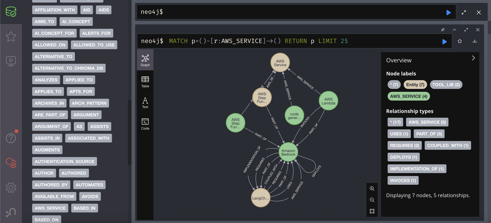

# 🧠 Bedrock AI Agents Knowledge Graph

[](https://www.python.org/downloads/)
[](https://fastapi.tiangolo.com/)
[](https://neo4j.com/)
[](https://qdrant.tech/)

> **Building a Knowledge Graph from "Generative AI with Amazon Bedrock" (Packt Publishing)**
>
> This repository implements a complete RAG (Retrieval-Augmented Generation) pipeline with Knowledge Graph capabilities, processing the book *"Generative AI with Amazon Bedrock"* by Shikhar Kwatra to create a searchable, interconnected knowledge base about building AI agents on AWS.

---

## 🎯 Project Goal

Transform the book's content into a **hybrid search system** combining:
- **Vector Search** (Qdrant) for semantic similarity
- **Graph Search** (Neo4j) for entity relationships and traversal
- **Knowledge Graph** with entities like AWS services, AI concepts, and their relationships

## 📸 Graph Visualization (Draft)



---

## 📚 Source Material

| Book | Author | Publisher |
|------|--------|-----------|
| *Generative AI with Amazon Bedrock* | Shikhar Kwatra | Packt Publishing |

The PDF was converted to Markdown using **MinerU** (desktop application) due to GPU/CUDA requirements for the API/container versions.

---

## 🏗️ Architecture

```
┌─────────────────────────────────────────────────────────────────────────┐
│                           RAG Pipeline                                   │
├─────────────────────────────────────────────────────────────────────────┤
│                                                                          │
│  📥 Stage 1: Process         → MinIO (source) → Redis (chunks)          │
│  🤖 Stage 2: Extract Entities → GLiNER (Salad.com GPU) → Redis          │
│  🔗 Stage 3: Extract Relations → Ollama Qwen2.5-7B → Redis              │
│  📊 Stage 4: Vectorize Chunks → bge-m3 (1024 dims) → Qdrant             │
│  🎯 Stage 5: Vectorize Entities → bge-m3 → Qdrant + Neo4j (nodes)       │
│  🔗 Stage 6: Vectorize Relations → bge-m3 → Qdrant + Neo4j (edges)      │
│                                                                          │
└─────────────────────────────────────────────────────────────────────────┘
```

---

## 🧰 Tech Stack

| Component | Technology | Purpose |
|-----------|------------|---------|
| **API** | FastAPI | REST endpoints for pipeline stages |
| **Vector Store** | Qdrant | Semantic search (3 collections) |
| **Graph Database** | Neo4j | Knowledge graph with APOC |
| **Cache** | Redis | Intermediate storage (48h TTL) |
| **Object Storage** | MinIO | Source documents |
| **Embeddings** | Ollama `bge-m3:latest` | 1024-dim vectors |
| **Entity Extraction** | GLiNER `urchade/gliner_large-v2.1` | GPU via Salad.com |
| **Relationship Extraction** | Ollama `Qwen2.5-7B-Instruct` | Local inference |

---

## 🚀 Quick Start

### Prerequisites

- Docker & Docker Compose
- Python 3.10+
- Ollama installed locally

### 1. Start Infrastructure

```bash
# Clone repository
git clone <repo-url>
cd contabo

# Start Docker services (MinIO, Neo4j, Qdrant, Redis)
docker-compose up -d

# Start Ollama with network access
OLLAMA_HOST=0.0.0.0 ollama serve
```

### 2. Pull Required Models

```bash
ollama pull bge-m3:latest
ollama pull hf.co/bartowski/Qwen2.5-7B-Instruct-GGUF:Q5_K_M
```

### 3. Start RAG API

```bash
cd rag-api
python -m venv venv
source venv/bin/activate
pip install -e .
uvicorn app.main:app --host 0.0.0.0 --port 8000 --reload
```

### 4. Access Services

| Service | URL |
|---------|-----|
| **Swagger UI** | http://localhost:8000/docs |
| **Qdrant Dashboard** | http://localhost:6333/dashboard |
| **Neo4j Browser** | http://localhost:7474 |
| **MinIO Console** | http://localhost:9001 |

---

## 📊 Pipeline Stages

The pipeline processes documents through 6 asynchronous stages:

| Stage | Endpoint | Process | Storage |
|-------|----------|---------|---------|
| 1 | `POST /pipeline/process` | Download + Chunk | Redis |
| 2 | `POST /pipeline/extract-entities` | GLiNER extraction | Redis |
| 3 | `POST /pipeline/extract-relationships` | LLM relationship extraction | Redis |
| 4 | `POST /pipeline/vectorize-chunks` | Embed chunks | Qdrant |
| 5 | `POST /pipeline/vectorize-entities` | Embed entities + Neo4j nodes | Qdrant + Neo4j |
| 6 | `POST /pipeline/vectorize-relationships` | Embed relations + Neo4j edges | Qdrant + Neo4j |

### Example: Run Complete Pipeline

```bash
# Stage 1: Process document
JOB_ID=$(curl -s -X POST http://localhost:8000/pipeline/process \
  -H "Content-Type: application/json" \
  -d '{"bucket": "documents", "file": "bedrock_docs.md"}' | jq -r '.job_id')

# Stage 2-6: Continue pipeline...
curl -X POST http://localhost:8000/pipeline/extract-entities \
  -H "Content-Type: application/json" \
  -d "{\"job_id\": \"$JOB_ID\"}"

# Check status
curl http://localhost:8000/pipeline/status/$JOB_ID
```

📖 **Full pipeline documentation**: [docs/PIPELINE.md](docs/PIPELINE.md)

---

## 🗄️ Data Collections

### Qdrant (Vector Search)

| Collection | Content | Dimensions |
|------------|---------|------------|
| `rag_embeddings_chunks` | Document chunks with entity context | 1024 |
| `rag_embeddings_entities` | Named entities (services, concepts) | 1024 |
| `rag_embeddings_relationships` | Entity relationships | 1024 |

### Neo4j (Knowledge Graph)

```cypher
// Entities with dynamic labels
(:Entity:AWS_SERVICE {name: "Amazon Bedrock"})
(:Entity:AI_CONCEPT {name: "RAG"})
(:Entity:GENAI_MODEL {name: "Claude"})

// Relationships
(bedrock)-[:PROVIDES]->(claude)
(rag)-[:USES]->(bedrock)
```

---

## 📁 Project Structure

```
contabo/
├── rag-api/                 # FastAPI application
│   ├── app/
│   │   ├── main.py         # FastAPI app entry
│   │   ├── pipeline_routes.py  # Pipeline endpoints
│   │   ├── graph_service.py    # Neo4j operations
│   │   ├── embed_service.py    # Embedding generation
│   │   └── ...
│   └── pyproject.toml
├── langgraph/              # LangGraph workflows
├── docs/                   # Documentation
│   ├── PIPELINE.md        # Pipeline stages detail
│   ├── ARCHITECTURE.md    # System architecture
│   └── ...
├── docker-compose.yml      # Infrastructure
└── README.md              # This file
```

---

## 📖 Documentation

| Document | Description |
|----------|-------------|
| [PIPELINE.md](docs/PIPELINE.md) | Complete pipeline stages with CURL examples |
| [ARCHITECTURE.md](docs/ARCHITECTURE.md) | System architecture and data flow |
| [DEPLOY.md](docs/DEPLOY.md) | VPS deployment guide |
| [KnowledgeGraph_Example.md](docs/KnowledgeGraph_Example.md) | Neo4j schema and queries |

---

## 🔧 Configuration

### Environment Variables

```bash
# Ollama
OLLAMA_BASE_URL=http://localhost:11434
OLLAMA_EMBEDDING_MODEL=bge-m3:latest

# Qdrant
QDRANT_URL=http://localhost:6333

# Neo4j
NEO4J_URI=bolt://localhost:7687
NEO4J_USER=neo4j
NEO4J_PASSWORD=neo4j_password

# Redis
REDIS_URL=redis://localhost:6379
REDIS_JOB_TTL=172800  # 48 hours

# MinIO
MINIO_ENDPOINT=localhost:9000
MINIO_ACCESS_KEY=minioadmin
MINIO_SECRET_KEY=minioadmin
```

---

## 🎓 Entity Types

Extracted entities are classified into:

| Type | Examples |
|------|----------|
| `AWS_SERVICE` | Amazon Bedrock, Lambda, S3 |
| `GENAI_MODEL` | Claude, Titan, Llama |
| `AI_CONCEPT` | RAG, Embeddings, Fine-tuning |
| `TOOL_LIB` | LangChain, LlamaIndex |
| `ARCH_PATTERN` | Agents, Multi-modal |
| `SECURITY` | IAM, Guardrails |
| `PROMPTING` | Few-shot, Chain-of-thought |

---

## 🤝 Contributing

1. Fork the repository
2. Create a feature branch
3. Make your changes
4. Submit a pull request

---

## 📄 License

This project is for educational purposes, demonstrating RAG and Knowledge Graph techniques with AWS Bedrock content.

---

## 🙏 Acknowledgments

- **Shikhar Kwatra** - Author of "Generative AI with Amazon Bedrock"
- **Packt Publishing** - Book publisher
- **AWS** - Bedrock and AI services documentation
